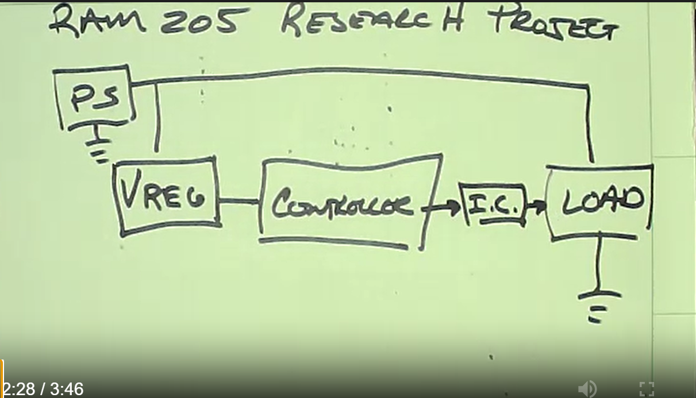

## RAM 205 - Robotics and Automation

### [RAM205](../../) - [Sprint 2](../) - Week 06

**Session 1**

- Grading - Gradebook is up to date through Week 05. Sprint 1 is completed. See gradebook for Sprint 1 percentage.

- Power-Output Drive Research 
  - Report out on Thursday (Sprint 2 points)

- PE Mod 2 Test due this week.
  - PE Mod 2 Review

- piRover Warner - review
    - warning1.py code review (blink)

- piRover Warner - extended
    - warning2.py - (LED and Buzzer)
    - warning3.py - (PWM with delay)
    - warning4.py, piRover_warner - (main that call module)
      
- piRover_warner - refactored using PWM and *private* functions

**Session 2**
 
- Power-Output Drive Research - Report-Out

  - Power Supply
  - High-power load
  - Controller
  - Interface Circuits - low power control of high-power load
  - Voltage source, regulation, current paths, etc

- piRover Warner - continued from Session 1
    - warning4.py, piRover_warner - (main that call module)
      
- piRover_warner - refactored using PWM and *private* functions

---

### Assignments

- The following submitted in this week zip file

  - PE1: Module 2 Test 
  - Power and Control research - Report-out and class discussion
  - piRover Warner
      - warning1.py (Amber LED lab check - MOSFET good?)
      - warning2.py code (with buzzer)
      - warning3.py code (PWM solution)
      - warning4.py code (piRover_warner solution)
      - piRover_Warner.py (piRover_warner solution)

