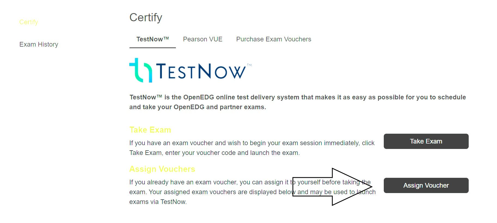
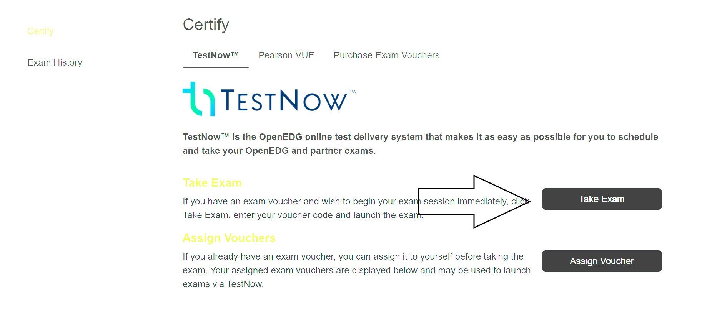

## RAM 205 - Robotics and Automation

### Certification Test

**Entering your Voucher Number**
1. Open the the Certification Exam submission link in Moodle. Locate your voucher code.

2. Open the certification site. Switch to certification page.

3. Click the Assign Voucher option. Copy your voucher code from the Moodle link into the text box provided.

4. With the voucher number entered, you can now complete the certification exam. You must follow the instructions when completing and submitting. Contact the instructor if you have questions.

5. Complete the exam by the deadline and capture an image of the final score. Submit this image to the Moodle link.
