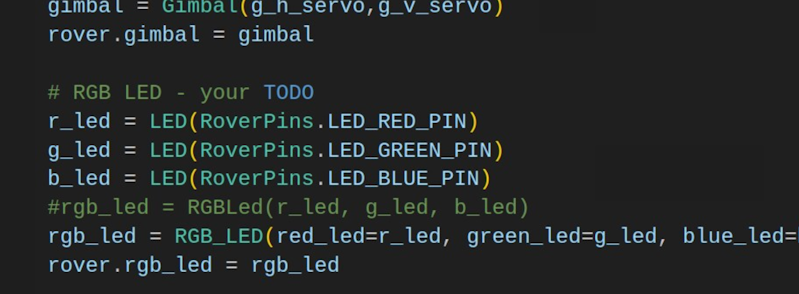

## RAM 205 - Robotics and Automation

### [RAM205](../../) - [Sprint 3](../) - Week 15

**Schedule**
- Week 15
  - Session 1
    - P03 Part 1 review
    - PE Review
    - Bluetooth service - setup and integration
  - Session 2  
    - PE Exam setup
    - Smartphone app intro
    - P03 Part 2 assigned
- Week 16 
  - Session 1: Final Project:
    - **P03 Part 2 Video due** - submit by end of day
    - No Zoom class but Keith is available
  - Session 2: **PE1: Certification** 
    - Complete and post cert results by the end of the day.
    - No class  


**Session 1**
- P03 part 1 review
  - Final Assessment review - p03_test_rover.py
    - rover.rgb_led
    - other?



- PE Review - PE_review.py

- Smartphone app - initial
  - Remove gimbal from factory
  - Add the following to your Model directory  
    - [Bluetooth Command Service](Bluetooth/BTCommandService.py){:target='_blank'}
    - [Bluetooth Commands](Bluetooth/BTCommands.py){:target='_blank'}
    
    ```
    wget https://k2controls.github.io/piRover02/sp3/w15/Bluetooth/BTCommands.py
    wget https://k2controls.github.io/piRover02/sp3/w15/Bluetooth/BTCommandService.py
    ```
  - Bluetooth testing
    

  
**Session 2**

<!-- - Python Certification Test 
  - [Preparation/Process](cert_test_directions/index.md)
    - Voucher Numbers - See PE: Certification assign link. Open to view comment. Copy voucher number.
    - Do system check prior to exam time. Use NMC workstation if in doubt.
    - Deadline to post PE Certification image is next Week 15 Session 2. -->


---

### Assignments
- None

#### Next week: ####
    - Video/Demo - app_smartphone with code submitted as support
    - PE Certification test results
