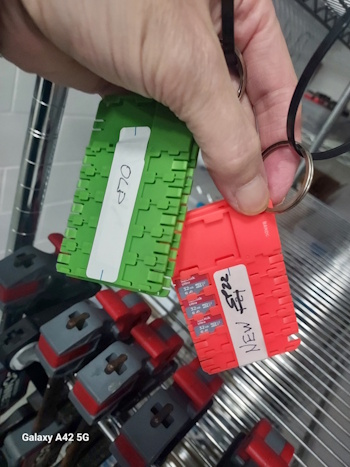
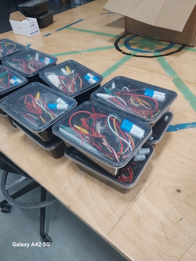

## RAM 205 - Robotics and Automation
### [RAM205](../../) - [Sprint 1](../) - Week 01

**Session 1**
- [Course Introduction/Syllabus](../../course_info/RAM205.Syllabus.pdf){:target="_blank"}
- piRover: Build and configure - RAM155 Review
  - Build
    - All RAM205 students must have the piRover system from prior RAM155
    - Issues? - please contact me immediately
  - Configure
    - SD card/OS required 
      - version - must be from Fall 2024
      - updated SD card required?
        - Pick up new SD card from my makerspace. See plastic cards hanging in RAM cage.
        
        - Leave old SD card
        - default password is **nmc_ram**
    - [Configure and Connect](https://k2controls.github.io/RAMcommon/remote_desktop/CreatingARemoteConnection.pdf){:target="_blank"}
      - See document link in Tools section. 
      - Note: VNC Viewer is no longer used. This revised document demonstrates the use of TigerVNC as a remote desktop client.
    - [Disabling Yahboom](DisablingYahboomBluetooth.pdf){:target="_blank"}
    - [Install VS Code](VisualStudioCodeGettingStarted.pdf){:target="_blank"}
- RAM205 kit - pick up one at NMC Makerspace
  - Content review in Session 2

- [Python Certification Overview](../../course_info/python_cert)
- [Raspberry Pi](https://raspberrypi.com){:target="_blank"}
  - TigerVNC remote connection - new!
  - Pi Configuration - review
  - Wi-Fi configuration - review
  - VS Code - review
- [Python Language and Programming](PythonIntroduction.pdf){:target="_blank"}
- Video recording using Zoom - testing!
  - leave class Zoom session
  - be sure you are logged into your Zoom account (NMC email)
  - open "My Personal Meeting"
  - share your screen
  - record to cloud
  - say "hello" and end meeting
  - open recordings
  - copy shared link
  - return to course Zoom
  - paste link in chat
    
**Session 2**

<!-- 
- Status of Zoom recording?
- My tests
  - [local](__video1437989670.mp4)
  - [Cloud](https://nmc.zoom.us/rec/share/dPG2JdQd1PrKjTGkg-CoMR6vTOTE8pll0Ovui1PilPI1PEPPXT08OIP0UZnl0SPL.hMTnhak94264Cuo4)

- [RAM205 Parts Kit](../../resources/RAM205_kit_BOM.pdf){:target="_blank"}
- [Stack Overflow 2023 Developer Survey](https://survey.stackoverflow.co/2023/){:target="_blank"}
- [Michigan's Hot 50](https://www.milmi.org/_docs/publications/Hot50_Statewide_2030.pdf){:target="_blank"}
- Demo: Python on workstation
  - [https://www.python.org/downloads/](https://www.python.org/downloads/){:target="_blank"}
  - [VS Code installation on workstation](https://code.visualstudio.com/Download){:target="_blank"}
  - Create workspace (folder/directory)
    - RAM205
  - Demo: Python on Raspberry Pi
    - python --version
    - python3 --version
    - rm -r temp
    - mkdir temp
    - [User Blink](python/user_blink.py){:target="_blank"}
    - wget -O user_blink.py https://k2controls.github.io/piRover02/sprint1/week01/python/user_blink.py
    - python3 user_blink.py
  - Demo: VS Code edit and debug
    - wget -O guessing_game.py https://k2controls.github.io/piRover02/sprint1/week01/guessing_game.py
    - breakpoints
    - debug (F5)
    - step into (F11)
    - step over (F10)
    - Go to definition (F12)  
- Circuit Analysis - A review
  - Voltage, Current, Resistance -->
  
<!-- - Power
  - Series and Parallel
  - KVL and KCL
  - Meter use
  - Power transmission concepts -->

---

### Assignments
- Pick up RAM205 Parts kit in Makerspace. See image above. **Required** for next week activities.
- PE1: Module 1
  - Create account and start Module 1
  - Quiz and Test in assigned in following weeks. See schedule.
- (optional) Python and VS Code install on your workstation
- piRover system functional with current OS version. Battery fully charged for Week 02.
- **Submit to Week 01 assignment link.**
  - Create a *RAM205_week01* video updating the instructor on the items listed below.
  - Submit the video either as a link or as an attachment to the Week 01 assignment link. (Link to Zoom cloud recording as tested in Session 1)
  - Include the following information or demonstrations.
      1. Connect via TigerVNC and demonstrate that your piRover as functional. Tell how or what you are testing. If not functional, discuss what are the barriers are preventing it from working.
      2. Where will you be working from during most class periods? What is your workstation configuration that you will use during class? Workstation? Multiple devices?
      3. Show your workstation and piRover setup. Share your screen showing TigerVNC remote connection with VS Code running on the Raspberry Pi.
      