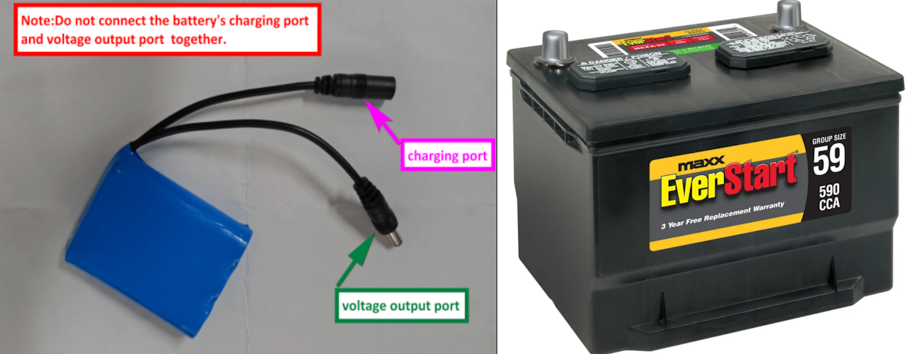

## RAM 205 - Robotics and Automation

### [RAM205](../../) - [Sprint 1](../) - Week 2

**Session 1**
- Note: No class next week Session 1 (Monday or Tuesday Jan 27-28). KEK is at a conference.

- Week 01 video and rover status - issues?
    - Is everyone able to connect via TigerVNC?
    - Is an Internet connection (Wi-Fi) configured?

- Circuit Analysis - a review
    - Ohm's Law, Power
    - Series and Parallel
    - KVL and KCL
    - Meter use
    - Power transmission concepts
    - Battery types: Yahboom vs. car starting
    

- DC Power Sources
    - [Voltage regulation](https://youtu.be/D52xUrIDrZY){:target="_blank"}
        - Rapberry PI power supply
            - Expansion board manual 
            - [Yahboom G1 Control Board Schematic](yahboom_G1_schematic.pdf){:target="_blank"}
            - Battery connection S3 and S4
            - VM
            - VCC
            - U10 3.3V
            - MVCC - 3.3V/5V
    - [Yahboom battery](Yahboom_power_supply_spec1.jpg){:target="_blank"}
    - [Yahboom battery specification](battery_spec.md){:target="_blank"}
- Activity:[Power Sources - Introduction](RAM205.PowerSourcesIntroduction.docx) (RAM205.PowerSourceIntroduction.docx)

**Session 2**

<!-- - Power Sources/Supplies
    - Yahboom G1 Tank - power distribution - review from Session 1
        - battery
            - Battery Charging - see manual
            - Similar on Amazon
                - [11.1V 2600mAh 3 Cell Lithium ion 18650 28.86Wh Rechange Battery Pack](https://www.amazon.com/dp/B08D2379MJ/ref=cm_sw_em_r_mt_dp_VEKNFQZZSG2D2EGG01YA){:target="_blank"}
                - [Yahboom battery](images/Yahboom_power_supply_spec1.jpg){:target="_blank"}
                - [2600mAh 3 Cell Lithium specification ](battery_spec.md){:target="_blank"}
                - Based on Yahboom spec and Amazon assumption, what is the current load of the system?
                - Inspect the battery charger. What is the current specification?
                - Does the charge time indicated in the Yahboom spec match your calculation?
    - ChatGPT prompt
        - I'd like a better understanding of battery discharge and its impact on the internal resistance of the dc voltage source. Please explain or provide links to resources.
        - Great. Now can you help me understand battery types and how the internal series resistance may differ from one to another. My project is using Lithium Ion battery.            
    - [Comparison between internal resistance and capacity test](internalRvsCapacityTest.pdf){:target="_blank"}
    - [Internal resistance of a voltage source](intresbeam.pdf){:target="_blank"}
    - [Power Sources](RAM205.PowerSources.pdf){:target="_blank"}
        - Battery test - RPi as load
            -Circuit and meter review
            - Test setup
            - VT, VL, and IL measurements
            - Results discussion
        - Motor drive as load
            - Create basic drive code
        - Testing and Data this week. Video report out next week. -->

---

### Assignments (submit in zip, see main Moodle page)

- PE1: Module 1 Quiz (screen capture)
- **Power Source - Introduction**
    - document with AA batteries ID and associated measurements and observations.
    - photo/image of test setup.
- Battery test video with data due next week.

<!--     
    **Assignment**
        - Create a *RAM205_week02* video
        - Submit the video either as a link or as an attachement to the Week 01 assignment link.
        - Demonstrate testing AA batteries using the multimeter
            - Show battery voltage of both using a DC voltage setting. Describe the load that the meter represents during this test. How much current is flowing from the battery?
            - Show battery testing using the multimeter's 1.5 volt battery test setting. Create a table showing the battery ID, the battery terminal voltage, the status of the battery, and the load current based on the multimeter input impedence (resistance).
        - Be prepared to ask clarifying questions at the start of Session 2 -->