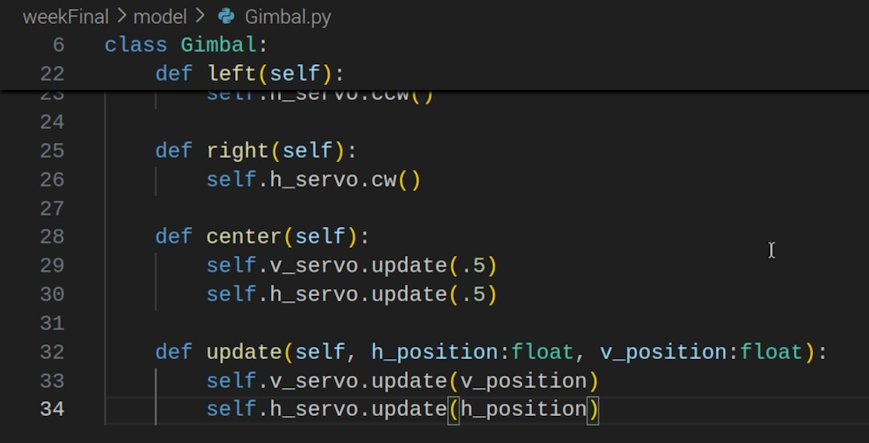
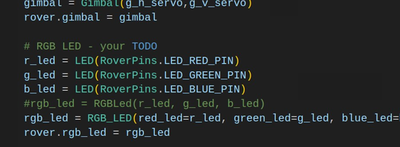

## RAM 205 - Robotics and Automation

### [RAM205](../../) - [Sprint 3](../) - Week 14

**Schedule**
  - Week 14  
    - PE: Summary Test due - See Moodle link
    - Session 1 - PE Review
    - Session 2 - PE Review - slicing and exceptions
    - Final Project:Coding review
    - Rover app
    - Final Project:Video assigned
  - Week 15 
    - Final Project:Code/Video due - No class, submit by end of day
    - PE1: Certification - No class, submit cert test results by end of the day

**Session 1**
  - Session 2 >> Final Assessment review - p03_test_rover.py
  - PE Review - PE_review.py

  - Smartphone app - initial
    - Add the following to your Model directory  
      - [Bluetooth Command Service](Bluetooth/BTCommandService.py){:target='_blank'}
      - [Bluetooth Commands](Bluetooth/BTCommands.py){:target='_blank'}
      
      ```
      wget https://k2controls.github.io/piRover02/sprint3/week14/Bluetooth/BTCommands.py
      wget https://k2controls.github.io/piRover02/sprint3/week14/Bluetooth/BTCommandService.py
      ```
    - Bluetooth testing
    
**Session 2**

- Python Certification Test 
  - [Preparation/Process](cert_test_directions/index.md)
    - Voucher Numbers - See PE: Certification assign link. Open to view comment. Copy voucher number.
    - Do system check prior to exam time. Use NMC workstation if in doubt.
    - Deadline to post PE Certification image is next Week 15 Session 2.

- P03 part 1 review
  - 10 submitted, 5 with 4.0 grade
  - Final Assessment review - p03_test_rover.py
    - rover.rgb_led
    - other?



- Smartphone app 
  - app_smartphone.py 
    - create starter code with instructor
    - complete solution
    - create video - the video must show you pressing controls on your smartphone and then the associated rover behavior.
    - Submit code and video link to the links provided. Deadline is Week 15, Session 1, end of the day.

- PE Review
  - slicing
  - exceptions

---

### Assignments

- Week 14 - PE Summary Test
- Week 15, Session 1 end of the day
  - weekFinal video (this is scored)
  - weekFinal coding (this is supporting content)
- Week 15, Thursday end of the day
  - PE Certification
